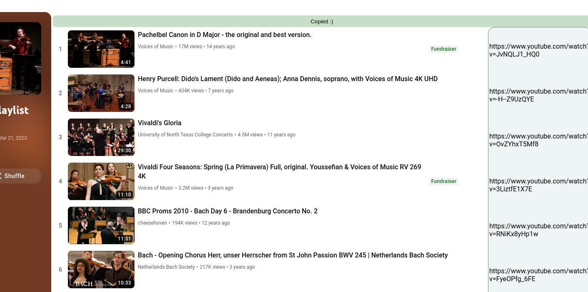

# ytp-playlist-urls

Visit any youtube.com/playlist URL

Generates a 1 column table containing the video URLs of each video in the playlist
Also provides a handy Copy button, which copies rich text format of the table
Pastable into any spreadsheet

Source code at: https://github.com/RepComm/ytp-playlist-urls

